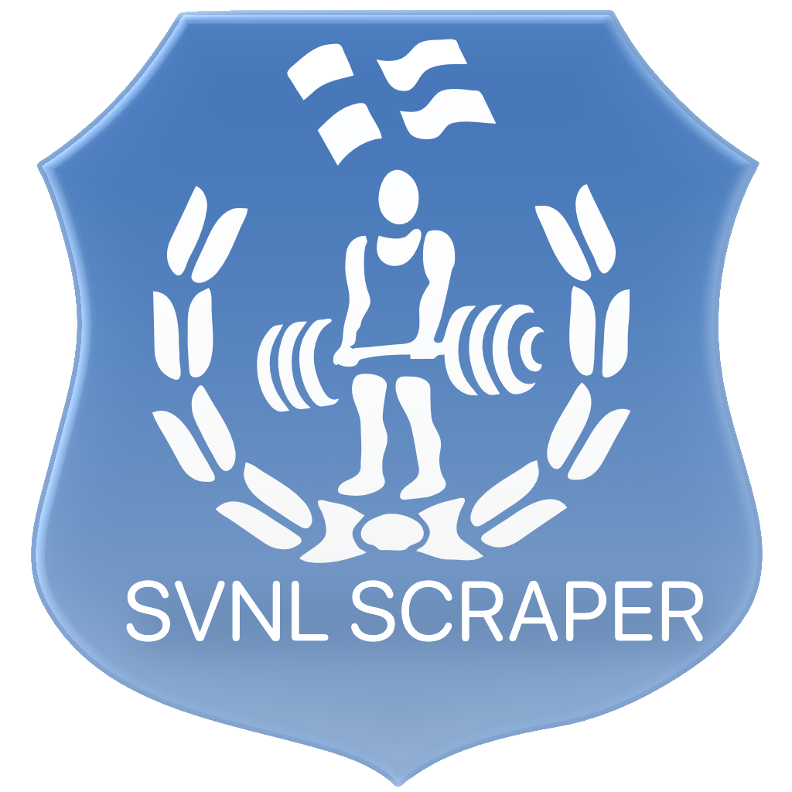

# SVNL Scraper

<div align="center">
    <br />
    <br />
    
    <br />
    <br />
</div>

A powerlifting competition data scraper for [Suomen Voimanostoliitto](https://www.suomenvoimanostoliitto.fi/) (Finnish Powerlifting Federation). Extracts lifter results (attempts, totals, bodyweight, etc.) and exports to CSV or JSON.

## Features

- **CLI** - Command-line interface for scripting and automation
- **TUI** - Interactive terminal UI with menus
- **Native macOS App** - GUI built with SwiftUI
- **Data validation** - Automatic validation of scraped data with detailed warnings
- **Incremental updates** - Caches HTML with hash comparison, skips unchanged competitions
- **JSON Output** - Machine-readable output for app integration
- **Per-competition output** - One file per competition by default (combined optional)

## Quick Start

```bash
# Install Bun: https://bun.sh
curl -fsSL https://bun.sh/install | bash

# Install dependencies
bun install

# Discover competitions from SVNL archive
bun run cli discover

# List cached competitions
bun run cli list

# Scrape specific competitions
bun run cli scrape svnl-pv-81 svnl-sm-2024

# Launch interactive TUI
bun run tui

# Build standalone CLI binary
bun run build:cli
```

## SwiftUI App

The macOS SwiftUI app lives in `SVNLScraper/`. It bundles the compiled CLI
binary (`svnl-cli`) and runs it for discover/scrape operations.

Open `SVNLScraper/SVNLScraper.xcodeproj` in Xcode and build the **Release**
configuration to bundle the CLI automatically. The build phase runs:

```
bun run build:cli
```

The app stores CSV/JSON output under `~/Documents/SVNLScraper` by default, and
logs under `~/Documents/SVNLScraper/logs/svnl-log.jsonl`. Both can be changed
in the app Settings. Output format (CSV/JSON) and per-competition vs combined mode are also configurable there.

## CLI Commands

```bash
# Discover competitions (clicks "Load more" 0 times by default)
bun run cli discover [--clicks <n>] [--browser <path>] [--log-dir <dir>] [--json]

# List cached competitions
bun run cli list [--format table|json]

# Scrape specific competitions by ID
bun run cli scrape <ids...> [--output <dir>] [--format csv|json] [--combined] [--force] [--validate] [--log-dir <dir>] [--json]

# Scrape all cached competitions
bun run cli scrape-all [--output <dir>] [--format csv|json] [--combined] [--force] [--validate] [--log-dir <dir>] [--json]
```

The `--json` flag outputs machine-readable JSON events for integration use.
By default, `scrape`/`scrape-all` write one file per competition into `./output`;
pass `--combined` to write a single CSV/JSON file.

The `--force` flag bypasses the cache and re-scrapes all competitions, even if
HTML hasn't changed. Without this flag, the scraper uses incremental updates
(caches table HTML and skips parsing if unchanged).

The `--validate` flag displays detailed validation warnings in the console. Validation
runs automatically on every scrape and includes checks for:
- Total calculation (sum of best lifts matches recorded total)
- Data completeness (name and club fields present)
- Reasonable ranges (weights 20-500kg, body weight 30-200kg)
- Attempt progression (successful attempts don't decrease)

In the TUI, output defaults to `./output`; you can change it under Settings.
Per-competition output is the default; change it under Settings. You can also
choose CSV or JSON output in Settings. Force mode can be toggled with 'f' in
the scrape selection screen. After scraping completes, the TUI shows a completion
screen with validation summary; press 's' to toggle detailed breakdown or Escape
to return to the menu.

## Requirements

- **Bun** - JavaScript runtime
- **Chrome/Chromium** - Required for discovery (clicking "Load more" buttons)

## Build a Standalone CLI

Compile the CLI into a single executable for embedding or distribution:

```bash
bun run build:cli
```

The output binary is written to `dist/svnl-cli`.

You can run the binary directly:

```bash
./dist/svnl-cli discover
./dist/svnl-cli scrape svnl-pv-81
```

## How It Works

1. **Discovery** uses Puppeteer to load the SVNL archive page and click "Load more" buttons
2. **Scraping** uses simple HTTP fetch (SVNL pages don't need JavaScript)
3. **Caching** extracts and caches table HTML with SHA-256 hash comparison (skips parsing if unchanged)
4. **Parsing** extracts lifter data from HTML tables
5. **Export** outputs results to CSV or JSON

Cached HTML is stored in `~/.svnl-scraper/html/` with only the relevant table data
(~90% storage savings vs full HTML). Use `--force` to bypass the cache.

## CSV Fields (selected)

- `event_type` is `sbd` or `b`
- `equipment` is `raw` or `equipped`
- `weight_class` is stored as a string (e.g. `-57`, `84+`)
- attempt success columns use `*_success` suffix

## Logs

Each operation appends a JSONL entry to `svnl-log.jsonl` with the operation
name and duration in milliseconds. Scrape operations include the competition
IDs in the log details.

- Logs default to `./logs` unless `--log-dir` is set
- In the TUI, log output defaults to `./logs` and is configurable under Settings

## Configuration

Set via environment variables:

- `SVNL_BROWSER_PATH` - Path to Chrome/Chromium executable

## Project Structure

```
src/
  cli/
    main.ts     # CLI entry point (Commander)
    types.ts    # TypeScript interfaces
    scraper.ts  # Discovery + scraping logic
    parser.ts   # SVNL HTML table parser
    validate.ts # Data validation with warnings
    cache.ts    # HTML caching with hash comparison
    output.ts   # CSV/JSON export
    log.ts      # JSON lines logging
  tui/
    main.tsx    # TUI entry point (Ink)
    types.ts    # TUI-specific types (Screen, OutputMode, OutputFormat)
    components/ # TUI view components
      MainMenu.tsx
      SettingsView.tsx
      DiscoverView.tsx
      ListView.tsx
      ScrapeSelectView.tsx
      ScrapingView.tsx
      ScrapeCompleteView.tsx
SVNLScraper/
  SVNLScraper.xcodeproj
  SVNLScraper/
    Resources/ # Bundled CLI (svnl-cli)
```
